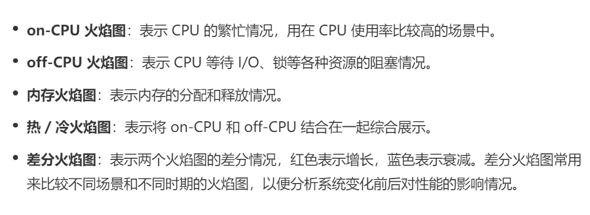

# linux_system_docs

## CPU

### 火焰图

我们根据性能分析的目标来划分，火焰图可以分为下面这几种：

- [使用 Perf 和火焰图分析 CPU 性能](https://senlinzhan.github.io/2018/03/18/perf/)
- [手把手带你入门火焰图——perf](https://zhuanlan.zhihu.com/p/486792358)
- [如何读懂火焰图？ 实例讲解程序性能优化](https://heapdump.cn/article/3486818)
- [【性能】如何使用perf和火焰图分析系统性能？](https://www.jianshu.com/p/ba7a42267234)
- [内存泄漏（增长）火焰图](https://heapdump.cn/article/1661654)

## 内存

## IO